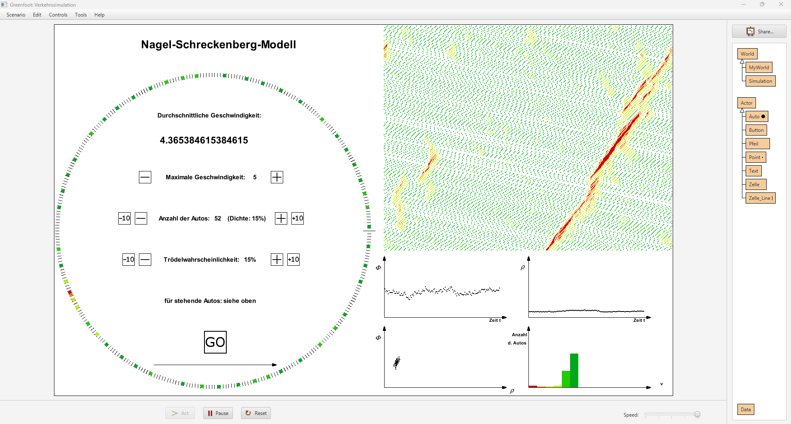

Seminar paper written in german on the topic "Traffic jam out of nowhere" based on the Nagel–Schreckenberg model.
See Seminararbeit.pdf to for the whole paper.

One of the basic outcomes of the of the work is for instance, that traffic jams quickly emerge purely out of nothing and keep moving against the direction of travel 
as one can see in the following screenshot of the implemented traffic simulation.

To run the simulation, the educational IDE [Greenfoot](https://www.greenfoot.org/) needs to be installed.

